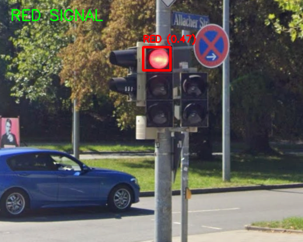
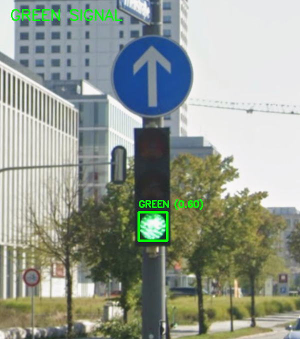

# 🚦 Traffic Light Detection using OpenCV

## 📌 Overview

This project detects traffic light signals (RED, YELLOW, GREEN) from images using classical computer vision techniques.

It uses color segmentation, contour filtering, and brightness analysis to identify the active traffic signal.

---

## 🎯 Features

* Detects RED, YELLOW, and GREEN traffic signals
* Uses HSV color space for robust detection
* Filters circular shapes using contour analysis
* Uses brightness and saturation to detect active bulbs
* Works on multiple images
* Automatically saves output results

---

## 🧠 Approach

The detection pipeline includes:

1. Convert image to HSV color space
2. Apply color masks for RED, YELLOW, GREEN
3. Perform morphological operations to remove noise
4. Detect contours
5. Filter shapes using:

   * Area
   * Aspect ratio
   * Circularity
   * Solidity
6. Apply brightness and saturation filtering
7. Select best detection using confidence score

---

## 🛠️ Technologies Used

* Python
* OpenCV
* NumPy

---

## 📁 Project Structure

```
traffic-light-detection-opencv/
│
├── main.py
├── requirements.txt
├── README.md
│
├── images/
│   ├── sample1.jpg
│   ├── sample2.jpg
│
└── results/
    ├── output images (generated automatically)
```

---

## ▶️ How to Run

### 1. Install dependencies

```
pip install -r requirements.txt
```

### 2. Add images

Place your images inside the `images/` folder.

### 3. Run the project

```
python main.py
```

### 4. View results

* Output images will be saved in the `results/` folder
* Detection results will also be displayed on screen

---

## 📸 Results

(Add your output images here after running the code)

Example:




---

## ⚠️ Limitations

* Performance depends on lighting conditions
* May detect false positives in complex backgrounds
* Not as robust as deep learning models

---

## 🚀 Future Improvements

* Integrate YOLO for object detection
* Improve robustness in low-light conditions
* Real-time video processing
* Combine with lane detection for ITS applications

---

## 👨‍💻 Author

Jigar Vegad
Master’s Student – Transportation Systems (TUM)
Aspiring AI Engineer 🚗
